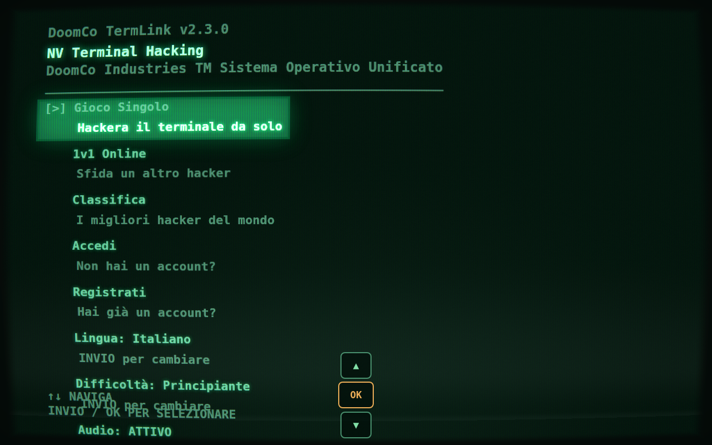
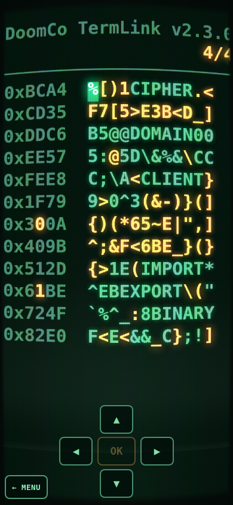
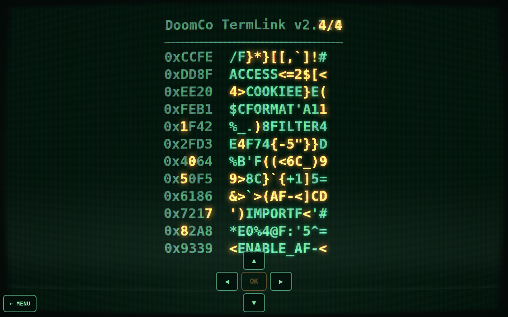

# NV Terminal Hacking

<p align="center">
  
</p>

<p align="center">
  <strong>Fallout: New Vegas–style terminal hacking</strong> — solo play, 1v1 online, leaderboard, PWA, and a full CRT phosphor interface.
</p>

<p align="center">
  <a href="#english">English</a> · <a href="#italiano">Italiano</a>
</p>

<p align="center">
  
  
  
  
  
  
</p>

---

## English

### Overview

**NV Terminal Hacking** recreates the iconic password minigame from *Fallout: New Vegas* as a modern web app. Navigate a hex-dump grid with arrow keys (or an on-screen D-pad on mobile), guess the password from likeness hints, and use bracket tricks to remove duds or refill attempts — all on a WebGL CRT terminal with scanlines, phosphor glow, procedural audio, and EN/IT localization.

### Screenshots

| Main menu (desktop) | Gameplay (mobile) |
|:---:|:---:|
|  |  |

| Gameplay (desktop) |
|:---:|
|  |

### Features

- **Authentic hacking loop** — word likeness (`X/Y correct`), 4 attempts, dud removal, bracket pairs `()` `[]` `{}` `<>`
- **CRT terminal UI** — WebGL post-processing (curve, scanlines, rolling refresh beam), canvas-drawn phosphor text
- **Fallout-style audio** — procedural SFX + 50s lounge radio loop (Web Audio, no external samples)
- **Solo & 1v1 online** — real-time multiplayer via Socket.io
- **Accounts & leaderboard** — JWT auth, PostgreSQL scores
- **Difficulty tiers** — Novice → Very Hard (word length, grid size, bracket count)
- **Languages** — English & Italian (UI + word lists)
- **PWA** — installable on desktop and mobile
- **Docker Compose** — one-command deploy

### Tech stack

| Layer | Stack |
|-------|--------|
| Frontend | React, Vite, WebGL CRT renderer, i18next, PWA |
| Backend | Express, Socket.io, JWT, bcrypt |
| Database | PostgreSQL |
| Shared | TypeScript game engine (monorepo workspace) |

### Quick start (development)

```bash
git clone https://github.com/doomL/nv-term-hacking.git
cd nv-term-hacking
npm install
cp .env.example .env

docker compose up db -d
npm run build -w shared
npm run dev
```

- Frontend: http://localhost:5173  
- Backend: http://localhost:3001  

### Deploy with Docker

```bash
cp .env.example .env
# Set JWT_SECRET and POSTGRES_PASSWORD in .env

docker compose up --build -d
```

App served at **http://localhost:3001** (static client + API + WebSocket).

### Project structure

```
├── client/              React app, CRT renderer, PWA
├── server/              Express API, auth, Socket.io rooms
├── shared/              Game engine & word lists
├── docs/screenshots/    README visuals
├── docker-compose.yml
└── NVHackingGuide.md    Game rules reference
```

### Game rules (short)

See [NVHackingGuide.md](./NVHackingGuide.md) for full rules.

1. Move with **arrow keys** (or D-pad / touch controls on mobile).
2. Select a **word** or **bracket sequence** and confirm.
3. Wrong guesses show **how many letters match** the password position.
4. Matching brackets remove a **dud** or **restore attempts**.
5. Win with **ACCESS GRANTED** before attempts reach zero.

### Environment variables

| Variable | Description |
|----------|-------------|
| `DATABASE_URL` | PostgreSQL connection string |
| `JWT_SECRET` | JWT signing secret |
| `CLIENT_URL` | Frontend origin (CORS) |
| `PORT` | Server port (default `3001`) |
| `VITE_API_URL` | API base URL (client build) |
| `VITE_SOCKET_URL` | Socket.io URL (client build) |

### Disclaimer

Fan-made project, not affiliated with Bethesda Softworks / ZeniMax Media.

---

## Italiano

### Panoramica

**NV Terminal Hacking** ricrea il minigioco del terminale di *Fallout: New Vegas* come web app moderna. Naviga la griglia esadecimale con le frecce (o il D-pad a touch su mobile), indovina la password dagli indizi di somiglianza e usa i bracket trick per eliminare dud o ripristinare i tentativi — il tutto su un terminale CRT WebGL con scanline, fosforo, audio procedurale e localizzazione IT/EN.

### Screenshot

| Menu principale (desktop) | Partita (mobile) |
|:---:|:---:|
|  |  |

| Partita (desktop) |
|:---:|
|  |

### Funzionalità

- **Meccanica fedele** — likeness (`X/Y correct`), 4 tentativi, rimozione dud, coppie di parentesi `()` `[]` `{}` `<>`
- **Interfaccia CRT** — post-processing WebGL (curvatura, scanline, raggio di refresh), testo fosforo disegnato su canvas
- **Audio stile Fallout** — SFX procedurali + loop radio anni ’50 (Web Audio, senza file esterni)
- **Singolo e 1v1 online** — multiplayer in tempo reale con Socket.io
- **Account e classifica** — autenticazione JWT, punteggi su PostgreSQL
- **Difficoltà** — Principiante → Molto difficile
- **Lingue** — Italiano e inglese (UI + liste parole)
- **PWA** — installabile su desktop e mobile
- **Docker Compose** — deploy con un comando

### Avvio rapido (sviluppo)

```bash
git clone https://github.com/doomL/nv-term-hacking.git
cd nv-term-hacking
npm install
cp .env.example .env

docker compose up db -d
npm run build -w shared
npm run dev
```

- Frontend: http://localhost:5173  
- Backend: http://localhost:3001  

### Deploy con Docker

```bash
cp .env.example .env
# Imposta JWT_SECRET e POSTGRES_PASSWORD in .env

docker compose up --build -d
```

App disponibile su **http://localhost:3001** (client statico + API + WebSocket).

### Struttura progetto

```
├── client/              App React, renderer CRT, PWA
├── server/              API Express, auth, stanze Socket.io
├── shared/              Motore di gioco e liste parole
├── docs/screenshots/    Immagini per il README
├── docker-compose.yml
└── NVHackingGuide.md    Regole di gioco
```

### Regole (breve)

Vedi [NVHackingGuide.md](./NVHackingGuide.md) per il regolamento completo.

1. Muoviti con le **frecce** (o D-pad su mobile).
2. Seleziona una **parola** o una **sequenza tra parentesi** e conferma.
3. I tentativi sbagliati mostrano **quante lettere coincidono** con la password.
4. Le parentesi corrispondenti rimuovono un **dud** o **ripristinano i tentativi**.
5. Vinci con **ACCESSO CONCESSO** prima di esaurire i tentativi.

### Variabili d'ambiente

| Variabile | Descrizione |
|-----------|-------------|
| `DATABASE_URL` | Connection string PostgreSQL |
| `JWT_SECRET` | Secret per firmare i JWT |
| `CLIENT_URL` | Origin frontend (CORS) |
| `PORT` | Porta server (default `3001`) |
| `VITE_API_URL` | URL base API (build client) |
| `VITE_SOCKET_URL` | URL Socket.io (build client) |

### Disclaimer

Progetto fan-made, non affiliato a Bethesda Softworks / ZeniMax Media.

---

## License

[MIT](./LICENSE)
